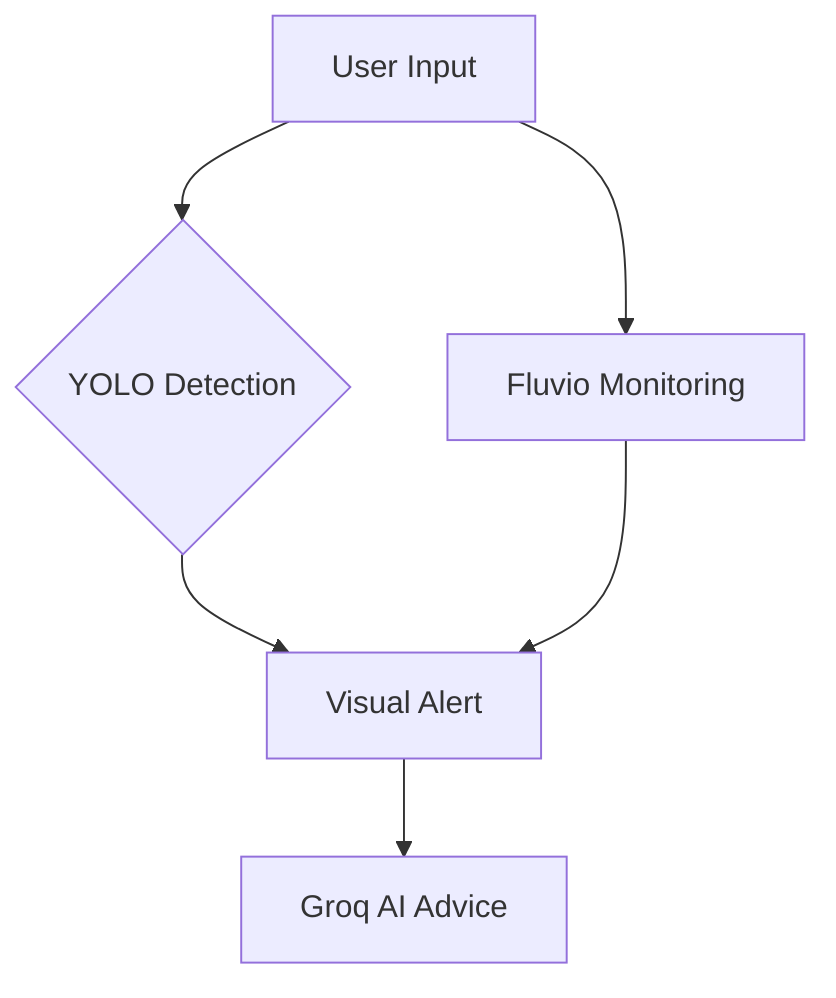

# 🛡️ GuardianFlux - AI-Powered Digital Identity Shield

**A Hackathon Project** | Built for **Hackazard** with ❤️  

  
*Combining YOLO object detection with real-time threat monitoring*

## 🚀 Key Features
- **AI Vision Shield**: YOLO-powered image/video recognition to detect exposed personal data  
- **Dark Web Radar**: Real-time monitoring of email/phone breaches (Fluvio-powered)  
- **Groq AI Advisor**: Instant security recommendations via natural language  
- **Threat Scorecard**: Risk assessment (1-10) for each detected exposure  
- **Zero Storage**: Your data never touches our servers  
- **Cross-Platform Alerts**: Web + Mobile notifications (Coming Soon)  

## 🛠️ Tech Stack
| Component           | Technology                          |
|---------------------|-------------------------------------|
| **Frontend**        | React (Vite), TailwindCSS           |
| **Backend**         | Node.js, Express                    |
| **AI Engine**       | YOLOv8, Groq API                    |
| **Real-Time**       | Fluvio (stream processing)          |
| **Computer Vision** | OpenCV, TensorFlow.js               |
| **Deployment**      | Netlify + Heroku                    |

## 💻 Installation
```bash
# Clone repository
git clone https://github.com/Zlmaoooo/hackazard.git

# Install dependencies
npm install  # For React frontend
pip install -r requirements.txt  # Python (Fluvio mock, YOLO)

# Run development servers
npm run dev  # Frontend
python fluvio_mock.py  # Simulated Fluvio stream
```

## 🔍 How It Works
1. **Upload** images/videos or enter contact info  
2. **YOLO AI** scans for exposed personal data (IDs, credit cards, etc.)  
3. **Fluvio** monitors dark web for matches in real-time  
4. **Groq AI** generates protection advice  
5. **Dashboard** displays threat visualization  



## 🌟 Roadmap
- [x] Phase 1: Dark Web Email Monitoring (Hackathon MVP)  
- [ ] Phase 2: YOLO Image Recognition Integration  
- [ ] Phase 3: Groq AI Chat Assistant  
- [ ] Phase 4: Mobile App with Push Notifications  

## 👥 Team
| Role                  | Contributor            |
|-----------------------|------------------------|
| **Project Lead**      | [Zlmaoooo](https://github.com/Zlmaoooo) |
| **Frontend Wizard**   | [Smriti](https://github.com/smriti1804)          |
| **Backend Ninja**     | [Sheeshz](https://github.com/Sheeshz) , [vdngkch](https://github.com/vdngkch)         |
| **UI/UX Designer**    | [Smriti](https://github.com/smriti1804)          |

## 🙏 Acknowledgments
- **Fluvio** for their revolutionary streaming tech  
- **Groq** for lightning-fast AI inference  
- **Bolt AI** for accelerating our prototyping  
- **Hackazard Organizers** for this opportunity  

---

📜 **License**: MIT  
🐛 **Issues**: [Report Here](https://github.com/Zlmaoooo/hackazard/issues)  
📧 **Emergency Contact**: `@Zlmaoooo` on GitHub  

*"Prevention is better than cure" - Our cybersecurity motto*
```
