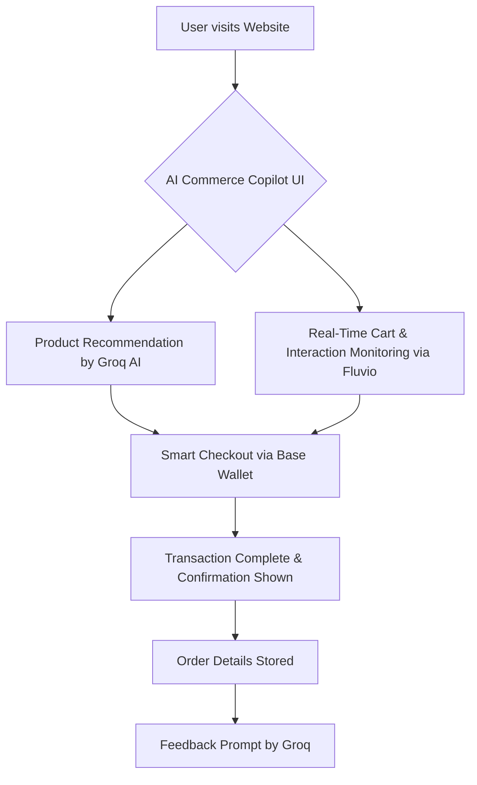

# 🛍️ AI Commerce Copilot

An AI-powered shopping assistant and real-time support dashboard built with modern technologies. AI Commerce Copilot redefines the e-commerce experience by enabling smart product discovery, instant checkout using wallets, and real-time support management — all in one seamless platform.

---

## 📌 Table of Contents

- [About the Project](#about-the-project)
- [Core Features](#core-features)
- [Technology Stack](#technology-stack)
- [Project Structure](#project-structure)
- [Workflow Diagram](#workflow-diagram)
- [How to Run Locally](#how-to-run-locally)
- [Contributors](#contributors)
- [License](#license)

---

## 📖 About the Project

AI Commerce Copilot combines cutting-edge technologies like Groq AI, Base Smart Wallets, and Fluvio event streaming to provide:

- Intelligent product recommendations and search
- Real-time customer support with smart ticketing
- Instant wallet-based checkout simulation
- A personalized shopping and admin experience

This project is ideal for developers looking to build next-gen e-commerce platforms powered by AI and real-time features.

---

## 🚀 Core Features

| Feature | Tags | Description |
|--------|------|-------------|
| 💬 Smart AI Chat Assistant | `AI`, `Groq`, `Chatbot` | Helps users search products via natural language |
| 🛒 Product Catalog & Filters | `UI`, `Search` | Shop by category, price range, and recommendations |
| ⚡ Instant Checkout | `Wallet`, `Base` | Simulated Base Wallet for buying products instantly |
| 🎟️ Ticketing & Support | `Support`, `Realtime`, `Fluvio` | Groq detects complaint type, triggers support ticket |
| 📊 Admin Dashboard | `Admin`, `Streaming`, `Firebase` | Real-time ticket tracking and response management |
| 👤 User Profile & Wallet | `User`, `Account` | Connected wallet, order history, basic user data |
| ✉️ Email Notifications | `Email`, `Optional` | Optional order/ticket updates via EmailJS |

---

## 🧱 Technology Stack

- **Frontend:** React + TypeScript + Tailwind CSS
- **AI & Chat:** Simulated Groq AI
- **Wallet System:** Simulated Base Smart Wallets
- **Streaming:** Simulated Fluvio (Firebase for real-time)
- **Backend/DB:** Firebase or local state
- **Other:** EmailJS (Optional), Vite (Bundler)

---

## 📁 Project Structure (Simplified)

```
/src
  /components      → Reusable UI Components
  /pages           → Home, Shop, Support, Profile, Admin
  /data            → Product list, Tickets (mock)
  /utils           → AI parser, Wallet handler
  /hooks           → Realtime data (Firebase/Mock)
  /assets          → Images, icons
```

---

Absolutely! Here's your **AI Commerce Copilot** project’s workflow in Mermaid (flowchart) format, structured just like your example:


## 🔄 Workflow Diagram




---

### 🧠 Explanation of Workflow Nodes:

| Node | Description |
|------|-------------|
| **A** | User visits the AI-powered shopping website |
| **B** | UI with chatbot, products, search bar |
| **C** | AI assistant (Groq) recommends products via natural language |
| **D** | User interactions/events streamed using Fluvio |
| **E** | Smart checkout using Base wallet for fast, secure payments |
| **F** | Confirmation UI updates and order is marked complete |
| **G** | Order details stored to DB or ledger |
| **H** | Groq AI asks for feedback or upsells |

---


## 🛠️ How to Run Locally

To run this project locally, you need to have the following installed:

### 🔧 Required Tools

| Tool      | Purpose                         |
|-----------|---------------------------------|
| Node.js   | JavaScript runtime (v18+)       |
| npm       | Package manager (comes with Node) |
| Git       | Clone and manage your repository |
| VS Code   | (Recommended) code editor       |

---

### 📥 Step 1: Install Node.js

#### 💻 For Windows / Mac

- Go to: https://nodejs.org/
- Download the **LTS version**
- Install it like a normal app  
- Verify installation in terminal:

```bash
node -v
npm -v
```

#### 🐧 For Linux (Debian/Ubuntu)

```bash
sudo apt update
sudo apt install nodejs npm -y
```

Or install the latest via `nvm` (Node Version Manager):

```bash
curl -o- https://raw.githubusercontent.com/nvm-sh/nvm/v0.39.7/install.sh | bash
source ~/.bashrc
nvm install --lts
```

Check if Node and npm were installed:

```bash
node -v
npm -v
```

---

### 🔧 Step 2: Clone the Repository

```bash
git clone https://github.com/your-username/ai-commerce-copilot.git
cd ai-commerce-copilot
```

---

### 📦 Step 3: Install Dependencies

```bash
npm install
```

---

### 🚀 Step 4: Start Development Server

```bash
npm run dev
```

Your app will be running locally at:  
**http://localhost:5173**

---

### 🖥️ Platform-Specific Notes

#### 🪟 Windows

- Use **Git Bash** or **PowerShell**
- Ensure Node.js is added to your PATH
- Use `npm run dev` in your project folder

#### 🍎 macOS

- Use **Terminal**
- Install Homebrew (if not installed):  
  ```bash
  /bin/bash -c "$(curl -fsSL https://raw.githubusercontent.com/Homebrew/install/HEAD/install.sh)"
  ```
- Then install Node.js:  
  ```bash
  brew install node
  ```

#### 🐧 Linux

- Use your system’s terminal
- Follow `apt` or `nvm` method above
- Run the app with:

```bash
npm run dev
```

---

Need help? Open an issue or contact one of the contributors


## 🙌 Contributors

A big shoutout to the amazing team behind AI Commerce Copilot:

| 👥 Role              | 🧑‍💻 Contributor    |
|---------------------|--------------------|
| 🧠 Project Lead      | **Zlmaoooo**       |
| 🎨 UI/UX Designer    | **[Teammate 3]**   |
| ⚛️ Frontend Wizard   | **[Teammate 1]**   |
| 🛠️ Backend Ninja     | **[Teammate 2]**   |


## 📜 License

This project is licensed under the **MIT License**.


MIT License

Copyright (c) 2025 Zlmaoooo

Permission is hereby granted, free of charge, to any person obtaining a copy
of this software and associated documentation files (the “Software”), to deal
in the Software without restriction...


> Built with ❤️ by learners and dreamers. Let’s create smarter e-commerce, together.
